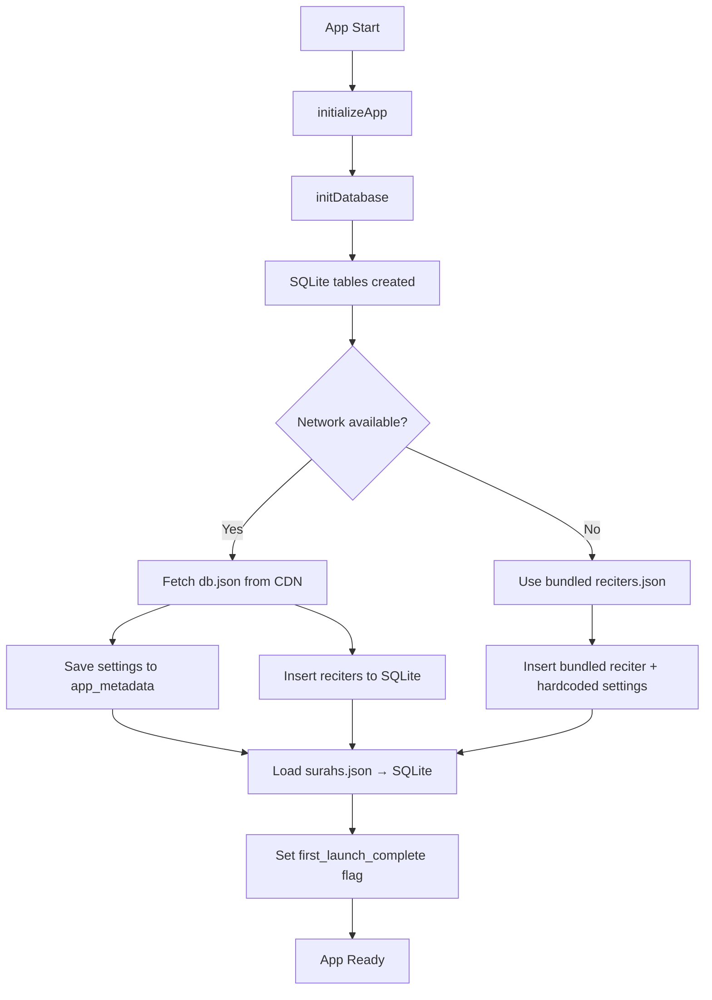
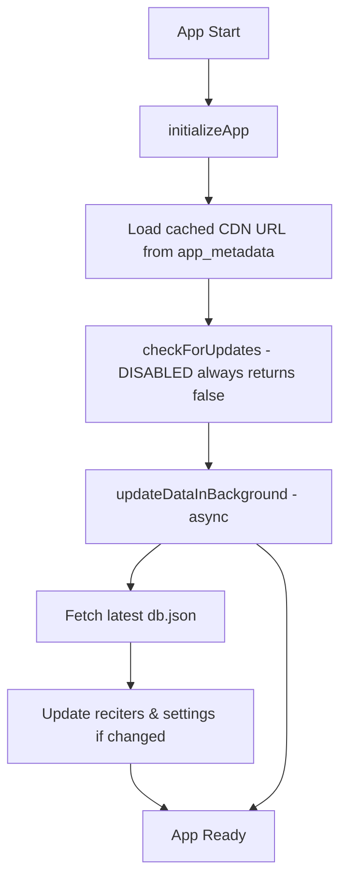

# Rabi App - Data Flow Architecture

## Overview

Rabi is a Quran recitation app with a hybrid architecture that combines:
- **Cloudflare R2 CDN** for metadata and media storage
- **Local SQLite database** for cached data
- **Bundled assets** for offline-first experience
- **Background synchronization** for data updates

## Data Sources & Locations

### 1. **Primary CDN (Cloudflare R2)**
```
https://pub-ab70d7236e61414aabfd72718fa65d27.r2.dev/
├── /metadata/db.json              # App settings & reciter list
├── /images/reciters/{id}.jpg      # Reciter profile photos
└── /audio/{reciterId}/{surah}.mp3 # Audio files (TODO: not yet implemented)
```

**Expected `db.json` format:**
```json
{
  "version": "1.0.0",
  "settings": {
    "cdn_base_url": "https://...r2.dev",
    "app_name": "Rabi",
    "support_email": "support@rabi.app",
    "app_version": "1.0.0",
    "min_app_version": "1.0.0"
  },
  "reciters": [
    {
      "id": "husary",
      "name_en": "Mahmoud Khalil Al-Hussary",
      "name_ar": "محمود خليل الحصري",
      "color_primary": "#1DB954",
      "color_secondary": "#1ED760"
    }
    // Additional reciters...
  ]
}
```

### 2. **Local Assets (Bundled with app)**
```
/assets/
├── data/
│   ├── reciters.json     # 1 reciter (fallback)
│   └── surahs.json       # 114 surahs (always bundled)
├── images/
│   ├── icon.png
│   ├── splash.png
│   └── notification_icon.png
└── fonts/
    └── surah_names.ttf
```

### 3. **Local Storage (SQLite Database)**
Database: `rabi.db`
```sql
-- Tables:
reciters (id, name_en, name_ar, color_primary, color_secondary)
surahs (number, name_ar, name_en)
downloads (reciter_id, surah_number, local_file_path, downloaded_at)
app_metadata (key, value)  -- For CDN URL, app settings, etc.
```

### 4. **File System (Downloaded Audio)**
```
{DOCUMENT_DIRECTORY}/audio/
├── {reciterId}/
│   ├── {surahNumber}.mp3
│   └── ...
└── ...
```

## Initialization Flow

### **First Launch**


### **Subsequent Launches**


**Note:** Version checking (`checkForUpdates`) has been disabled to remove update banners.

## Audio Playback Flow

### **Streaming vs Downloaded**
```mermaid
graph TD
    A[Play Track] --> B{Is downloaded?}
    B -->|Yes| C[Use local file: {DOC_DIR}/audio/{reciter}/{surah}.mp3]
    B -->|No| D[Use remote URL]
    D --> E{Current source?}
    E -->|Demo| F[https://server13.mp3quran.net/husr/{surah}.mp3]
    E -->|Future R2| G[https://cdn.r2.dev/audio/{reciter}/{surah}.mp3]
    C --> H[expo-audio player]
    F --> H
    G --> H
    H --> I[Playback]
```

### **Audio Service Architecture**
```
AudioContext (React Context)
    ↓
AudioService (Singleton class)
    ↓
expo-audio player (Native)
    ↓
Media Controls (Lock screen/notifications)
```

**Key features:**
- Background playback support
- Media controls integration
- Sleep timer functionality
- Playback modes (sequential, shuffle, repeat)
- Offline detection & handling

## Download System

### **Download Flow**
```mermaid
graph TD
    A[User initiates download] --> B[downloadSurah]
    B --> C[Get audio URL from config]
    C --> D[expo-file-system DownloadResumable]
    D --> E[Save to {DOC_DIR}/audio/{reciter}/{surah}.mp3]
    E --> F[Insert record to downloads table]
    F --> G[Update DownloadContext state]
    G --> H[Progress UI updates]
```

### **Download Management**
- Concurrent downloads limited to 2
- Queue system for pending downloads
- Progress tracking with callbacks
- Storage usage calculation
- Automatic cleanup on delete

## State Management

### **Context Providers**
```typescript
// App hierarchy:
<NetworkProvider>          // Network status monitoring
  <AudioProvider>         // Audio playback state
    <SleepTimerProvider>  // Sleep timer functionality
      <DownloadProvider>  // Download management
        <App UI>
```

### **Persisted State**
1. **SQLite:**
   - Reciters & surahs
   - Download records
   - App metadata (CDN URL, settings)

2. **AsyncStorage:**
   - `first_launch_complete` flag
   - Listening sessions (via audioStorage service)

3. **File System:**
   - Downloaded audio files
   - Temporary download files

## Network & Sync Strategy

### **Offline-First Design**
1. **Always available:**
   - Bundled surahs (114)
   - Bundled reciter (1)
   - Downloaded audio files

2. **Network-dependent:**
   - Additional reciters from CDN
   - Reciter profile photos
   - Streaming audio (if not downloaded)
   - Background updates

### **Background Sync**
- Triggered when network becomes available
- Fetches latest `db.json` from CDN
- Updates reciter list and settings
- Silent operation - doesn't block UI
- Failure tolerant - uses cached data

## Configuration Management

### **Dynamic CDN URLs**
```typescript
// Default (hardcoded):
let CDN_BASE_URL = 'https://pub-ab70d7236e61414aabfd72718fa65d27.r2.dev'

// Can be updated remotely via db.json:
{
  "settings": {
    "cdn_base_url": "https://new-cdn.example.com"
  }
}
```

**Update flow:**
1. App fetches `db.json`
2. Extracts new `cdn_base_url`
3. Updates in-memory config
4. Persists to `app_metadata` table
5. Future requests use new URL

## Error Handling & Fallbacks

### **Graceful Degradation**
1. **CDN unavailable:** → Use bundled `reciters.json`
2. **Network offline:** → Use cached data + downloads
3. **Download fails:** → Stream from backup source
4. **Database error:** → Continue with partial data
5. **First launch failure:** → Use minimal bundled data

### **Recovery Strategies**
- Automatic retry on network recovery
- Background updates on app foreground
- Cache invalidation with version checks
- Storage cleanup on app start

## Current Limitations & TODOs

### **Audio Source**
```typescript
// Current (demo):
return `https://server13.mp3quran.net/husr/${surahPadded}.mp3`;

// TODO (production):
return `${CDN_BASE_URL}/audio/${reciterId}/${surahPadded}.mp3`;
```

### **Missing Features**
1. **Audio files not in R2** - Currently using mp3quran.net
2. **Reciter photos** - Should be in `/images/reciters/{id}.jpg`
3. **Complete `db.json`** - Not verified in R2 bucket
4. **Dynamic reciter updates** - Requires `db.json` with full list

## Data Flow Summary

### **Read Operations**
```
UI → Context → Service → [SQLite | File System | CDN]
```

### **Write Operations**
```
UI → Context → Service → [SQLite | File System] → Async confirmation
```

### **Sync Operations**
```
Network event → dataSync → CDN → SQLite → Context update
```

## Development Notes

### **Testing Data Flow**
1. **First launch:** Clear app data, test offline/online
2. **CDN updates:** Modify `db.json` in R2, restart app
3. **Downloads:** Test with different network conditions
4. **Playback:** Switch between streaming/downloaded

### **Future Scalability**
- Add authentication for premium content
- Implement analytics tracking
- Add user preferences sync
- Expand reciter metadata (biography, styles, etc.)
- Support multiple audio quality levels

---

*Last Updated: 2025-12-22*
*App Version: 1.0.0*
*Architecture: React Native/Expo with TypeScript*